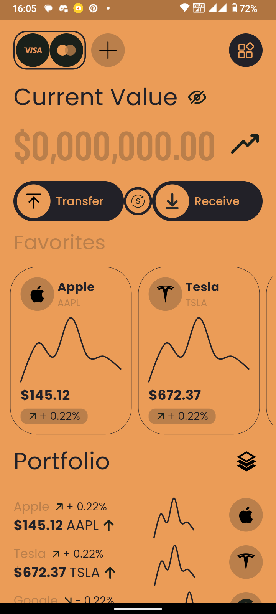
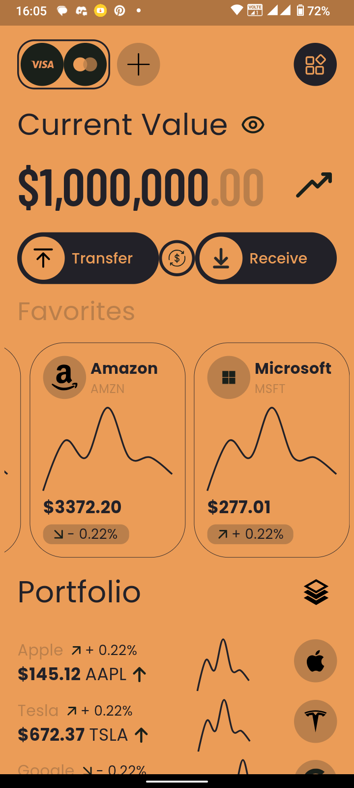
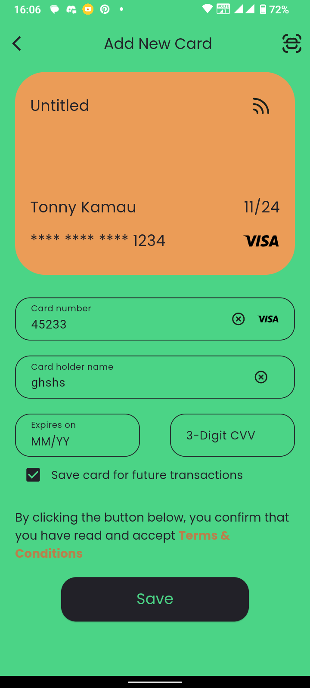

# Wall Street

A new Flutter project replicating a Dribble UI design for a crypto wallet app.

[Dribble Design Reference](https://dribbble.com/shots/20789146-Crypto-Wallet-App)

## Getting Started

This project is a replica of a crypto wallet mobile app UI, initially designed on Dribble. It's developed in Flutter to demonstrate beautiful and responsive UI practices in mobile app development.

## App Screenshots

  
  
  

